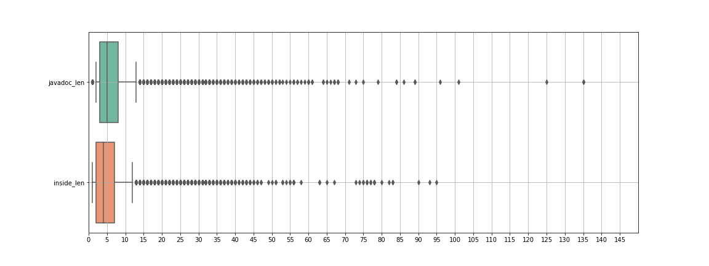

# An Empirical Study on Code Comment Completion

In thiw work we present a large-scale empirical study in which we assess the ability of a simple *n*-gram model and of the recently proposed Text-To-Text Transfer Transformer (T5) architecture (https://github.com/google-research/text-to-text-transfer-transformer) in supporting code comment completion for Java programs.


#### Pipeline to experiment with the T5 model

In order to pre-train and then finetune a [T5 small](https://github.com/google-research/text-to-text-transfer-transformer) model, we need a new sentencepiece model to accommodate the expanded vocabulary given by the java programming language, and technical natural language.


*  ##### How to train a new <a href='https://github.com/google/sentencepiece/blob/master/python/README.md'>SPmodel</a>

    *Pythonic way*

    ```
    pip install sentencepiece
    import sentencepiece as spm
    spm.SentencePieceTrainer.train('--input=pretraining.txt --model_prefix=dl4se --vocab_size=32000 --bos_id=-1  --eos_id=1 --unk_id=2 --pad_id=0') 
    ```
    The new model has to be trained on the entire pre-training corpus.

* ##### Set up a GCS Bucket
    To Set up a new GCS Bucket for training and fine-tuning a T5 Model, please follow the orignal guide provided by <a href='https://www.google.com'> Google </a>. 
    Here the link: https://cloud.google.com/storage/docs/quickstart-console
    Subsequently, by following the jupyter notebook we provide for pre-train and fine-tune the network, you should be able to set up the final environment.

* ##### About the datasets

    The datasets for the T5 model and for the N-Grams models can be found here: https://drive.google.com/drive/folders/1BFkABylRrbHaqUmH7QR8R47PQTEzmjGb?usp=sharing

* ##### Pre-training/Fine-tuning 
  
    To pre-train and then, fine-tune T5, please use the script we provide here:
    - <a href ='https://github.com/antonio-mastropaolo/ICSME2021-Completion/blob/main/Models-Code/T5/Pre-training/Pretraining.ipynb'>Pre-Training</a> 
    -  <a href ='https://github.com/antonio-mastropaolo/ICSME2021-Completion/blob/main/Models-Code/T5/Fine-tuning/Finetuning.ipynb'>Fine-Tuning</a> 


#### Pipeline to experiment with the N-Grams model

<a href='https://github.com/antonio-mastropaolo/ICSME2021-Completion/tree/main/Models-Code/N-Grams'>Here</a> you can find our implementation of the N-Grams models.
To train a new {3-5-7}-Gram model, first install all the requirements ```pip install -r requirements.txt```, then set the right path to load train and test files.
Finally, you can run: ```python3 main.py --n 3 --save_file_name 3-Grams.pickle``` to create a new 3-Gram model and test it on the test set.
    
------------------------------------------------------------------------------------------------------------------------------------------------------------------------------------------------------

**Additional:** In <a href='https://github.com/antonio-mastropaolo/ICSME2021-Completion/tree/main/Miscellaneous'>Miscellaneous</a> folder, you can find all the additional notebooks we used for computing the BLEU score, the Levenshtein distance, the McNemar statistical test and the overlap metrics. Furthermore, <a href='https://drive.google.com/drive/folders/1pQKhs3NG26tbc3oQlzD9ylPIW2o20Eqt?usp=sharing'>here</a> and <a href='https://drive.google.com/drive/folders/1RF8Nv9Q7I1ArptFkmgu2qM_A-OrPx3gH?usp=sharing'>here</a> you can experiment with our pre-trained and fine-tuned models.

##### Our results:  <a href='https://drive.google.com/drive/folders/1I2HBKy6HvFgn-E2orJIentxpc5qGEbGe?usp=sharing'>:open_file_folder: </a> 


------------------------------------------------------------------------------------------------------------------------------------------------------------------------------------------------------
#### Ablation Study <a href='https://drive.google.com/drive/folders/1uRBbFDceYZTCwQhUnxTtKRoQemUzQIyy'>:chart_with_upwards_trend:</a> 


------------------------------------------------------------------------------------------------------------------------------------------------------------------------------------------------------
#### Test-set statistics 


In this section we report additional information about the qualitative analysis we performed


 
    

